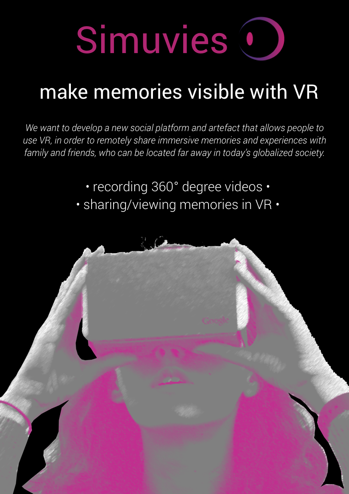

# Group 11 Blog
Welcome to the blog of group 11.
## Description

We want to develop a new social platform and artefact that allows people to use VR, in order to remotely share immersive memories and experiences with family and friends, who can be located far away in today’s globalized society.

Current research and new products suggest that virtual reality and social media are developing rapidly as separate trends, but also in collaboration. We want to explore this pattern and inspired by the problem of disconnection in a globalized society, and we aim to examine how VR and social media could work together to bring people together. Our project aims to design a platform and an artefact that allows people to remotely share their memories and experiences with family and friends in virtual reality and bring them along on their journey. Hence, we want to improve communication between people by offering an immersive virtual reality experience. Furthermore, we want to explore how we can include other senses (light, wind, temperature) in the interactive experience as well, in order to increase the immersion.

## Poster

