# [Week 12] 13.04
## Main points
- We met with the tutor again to discuss the concept, slides and video, as well as the change in requirements.
- We prepared a draft for the final report
- We came up with a plan for the new video
- Planned new storytelling components of our presentation

## Notes
- presentation doesn’t need to be narrated 
- Overview of concept in video 
- More talk about psychology of VR 
  - VR goes beyond messaging, because it involves the senses, it engages the brain in a different matter; could be used for therapy 

### Slides 

- Stages: 

1. Research 
  - Inspiration – other VR projects that have inspired us 
2. Development 
3. Refinement 
   - Moved the camera after feedback from other groups  
   - How the object we have now materializes the argument at the beginning? 

### Video 

We need to extend our current video with:

   - More explanations and text between the VR and normal view 
   - Text is hard to read – bigger font size 
   - How can we explain our main argument? What are the main benefits? 
     - Why 360 videos? 
     - Feel less alone? 
     - Talk about Maslow’s pyramid? It supports one of the people’s main needs. Talk about the psychology of communication 
       - Give an example of the current situation – this is one of the very few options for communication 
       - Can be used in the future for similar situations 
   - Showing like on the degree show 
   - Who are we? 
     - Our backgrounds 
     - We are interested in VR because of … 
   - How can the argument be augmented via a video, a comic, bubbles like a dialog 
   - What makes it so special? Tell a story 
   - Problems with the prototype:  We are thinking about the near future. There are limitations but they can be overcome. 
     - It’s speculative and it has some limitations 
     - The cameras are expensive right now 
     - The future: they can be widely available 

# [Week 11] 03.04

## TODOs
- Meet with tutor

## Meeting Notes
We discussed about demo slides, Effi gave sugguestions about how to modify and refine the slide. We also talked about how to the content of video, and how to prepare for final report. 

### Video
-	Tell a story. Explain why someone would use it (e.g. from our persona’s point of view), why would there would be a problem. How does the interaction work? What problem does it solve?
-	Explain the VR research background – how would VR work in our context? Why?
-	Have a look at the storytelling resources Effi send and come up with something easy to understand
-	We need to improve the story in the video

### Slides
-	The slides need to be understandable (!!!) since we will not be presenting. 
-	Effi will take look at the slides and tell us
-	Explain the triangle better
-	Change “More to explain” to something else -> “Why we do this?”
-	More on psychology research
-	Slide 6 -> it’s not clear if it’s VR in general or our own artefact; Relate to our project why people would use VR 
-	Slide 7 -> not very useful; consider removing it
-	Change font of body text and make it bigger; titles are ok
-	Use one of the characters and build a story around it
-	Personas are too descriptive: be more speculative based on our research. Why? What is her motivation to use our artefact; Make stuff up, make up scenarios and explain WHY 
-	Why our object is so amazing? What happens after it? Does it help her build a better connection with her family? 
-	Mention the Covid-19 situation – our app would help with isolation
-	Drawings are very nice – video telling the story of Kim for example
-	Make our argument stronger: alternative usages: to be used in therapy for example. For research purposes across distributed institutions (e.g. University of Edinburgh and University of Munich) 
-	More references why the object amazing
-	Justification: why is it important? Because of the research, because of personal interest of the group

### Artefact
-	References regarding the design of the artefact

### Report
-	How to share a remote experience
-	Triangle: Communication, Psychology
-	Talk about the stage of VR, talk about the context
-	How is VR used in society? For good? For bad?

# [Week 9] 19.03

## TODOs
- Refine slides
- Do more research about VR 

### Storyboard
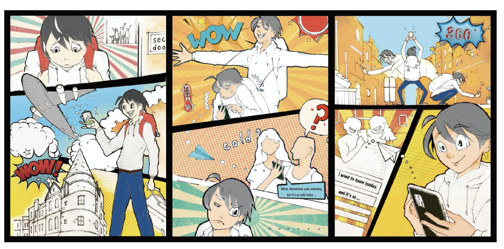

### Kim's Scenario
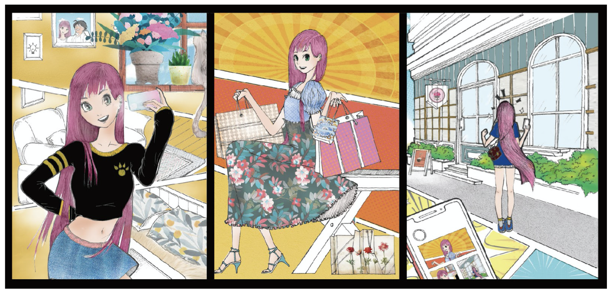

### Artefact
#### Inspiration
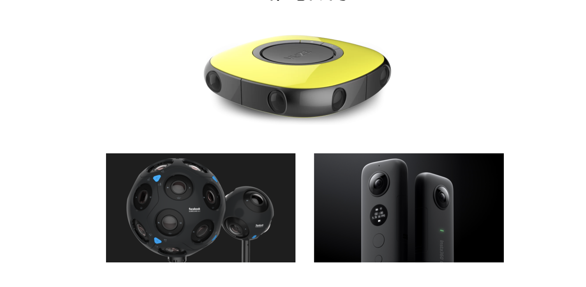
#### Record memories:mobile, wearable 360° camera*
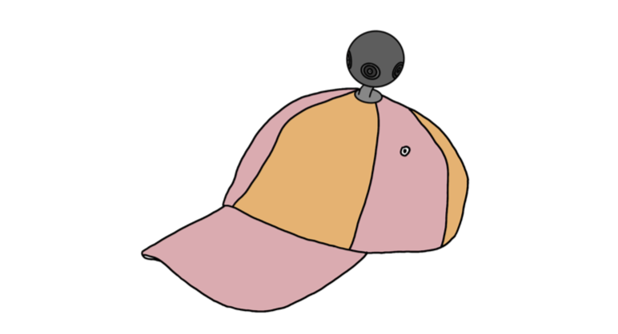
#### Preview memories:VR glasses
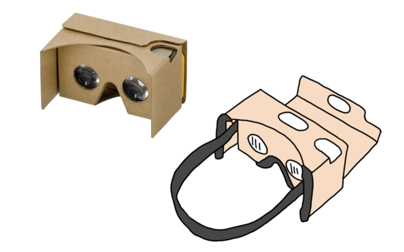

### Slides link
[Demo Slides](https://docs.google.com/presentation/d/1LnFnmBx0IVssXUSkvFbAaTQ4ztesagvLyG7DXKf8QbA/edit?usp=sharing)

# [Week 8] 14.03

## TODOs
- Shoot Kim's scenario video
- Edit video
- Edit demo session slides

## Meeting Notes
- A new video has been filmed
- Ula was responsible for editing video

### UI Interface
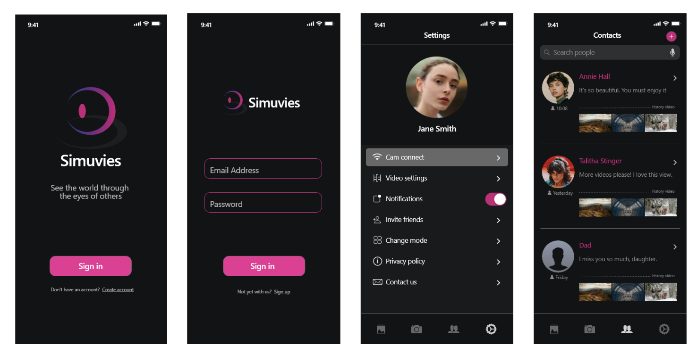

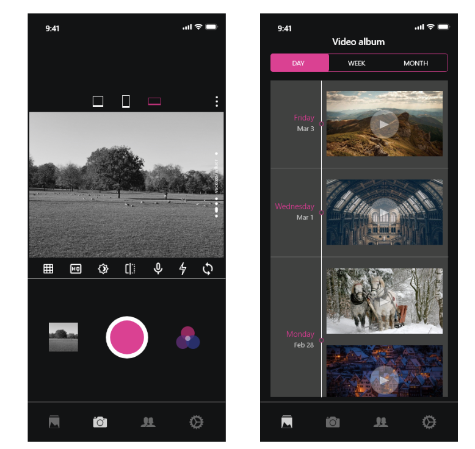

### Peirce's Triadic Mode
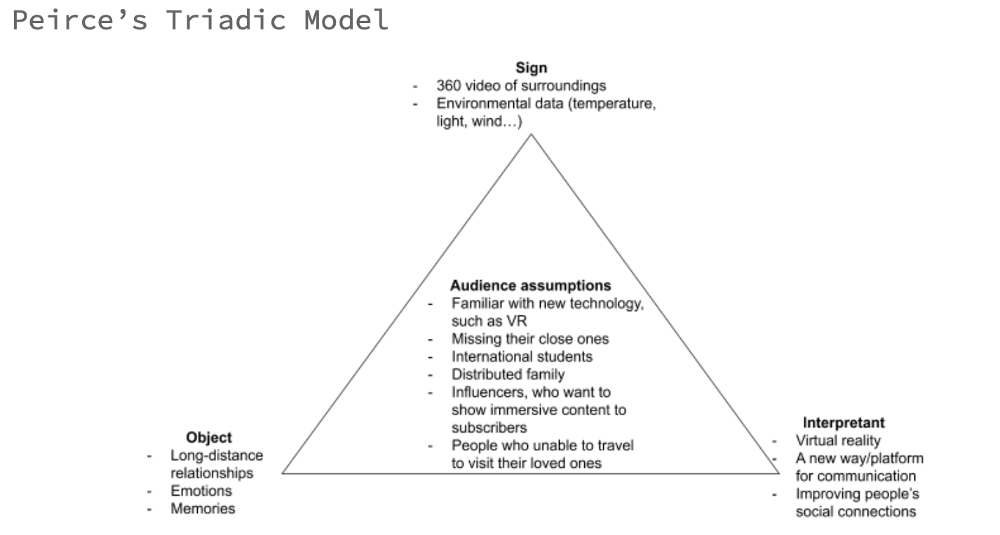

### Video Link
[Kim's Story](https://drive.google.com/file/d/1IQssPpscF2sAulf-p7ptMboklYErWLmh/view?usp=sharing)

# [Week 7] 03.03

## TODOs
- Prepare for the Demo
- Seperate work tasks
- Refines the artefact design after peer review

## Meeting Notes
- A new design has been confirmed after considering peers review
- Seperated tasks to group members 
- Planed for next step: review UI design, make slides for the Demo show

## Research 
### Maslow's Hierarchy of Needs
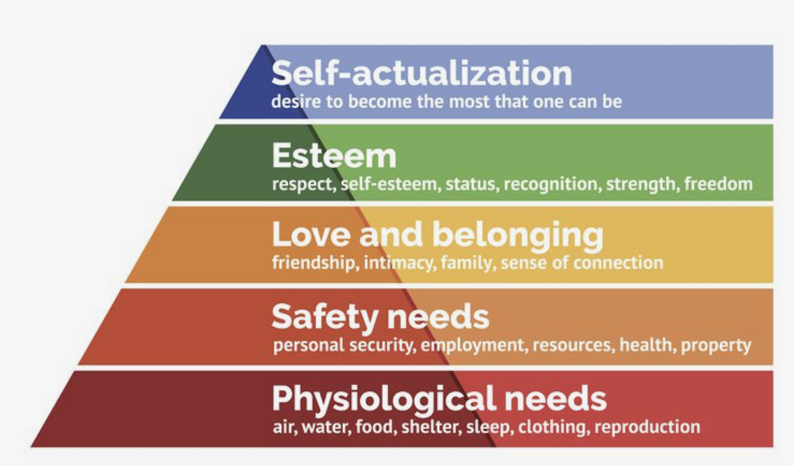
* According to this concept, people don’t feel the second need until the demands of the first have been satisfied, nor the third until the second has been satisfied, and so on.
* The need of using different methods to communicate with others belongs to the third level need. People try to overcome feelings of loneliness and alienation via sharing pictures, videos, and texts, etc. Multiple social medias and technologies were created to satisfy this need, including VR.

### Features of VR
* Provide a virtual world that independently exist from the real world. 
* Via VR headsets and headphones to occupy user’s vision and sounds filed, fully immersing users in a virtual world. 
* By moving head or body, user will be given a simultaneous sensory feedback, the feeling that they are moving in the virtual world. 
* User can interact with virtual elements in the simulated environment with controllers. 

### Why is Facebook, Snapchat became so pupular
* A study shows, FB uses is mainly driven by two basic social needs: (1) need to belong and (2) need for self-presentation. The need to belong refers to the intrinsic drive to affiliate with others and get social acceptance, and the need for self-presentation to the continuous process of impression management.  
* Snapchat interactions are perceived as more enjoyable. Only trusted ties are allowed to access people’s spontaneous experience sharing in Snapchat. 

### Format of sharing 
* Pictures
* Videos
* Voices
* Texts
* Immersive experience

# [Week 6] 18.02

## TODOs
- Film 360 degree videos 
- Upload videos to Youtube
- Generate personas and scenarios

## Meeting Notes
- Four videos has been filmed and uploaded to Youtube
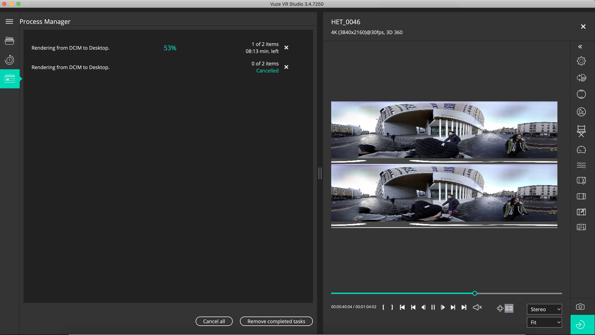

- Generated 3 different personas, and 3 scenarios for each persona

## Personas and Scenarios 
***1. Kim***
- 22 years old 
- Master Student in Fasion Design
- Female
- Korean

Personality: 
She’s now a master student studying Fashion Design at Edinburgh College of Art, she likes fashion industry, swimming and staying at home, now she is living in a student studio out of the campus.
She’s an outgoing and independent person, this is not her first time leaving home and live in other cities. She loves sharing her life on social media and has a bit social media addiction. 
#### Scenario (sharing on socila media, her family)
- She would like to share her room tour to her family
- She went to princess street shopping and buying daily goods.
- She showed a nice and popular cafe close to her dorm.

***2. Peter***
- 30 years old
- Visitor
- Male
- American

Personality: 
He is a management in a business company, he likes travelling and workouts a lot. He’s a easy-going and talkative person. He enjoy extreme outdoor sports and he always buys the latest iPhone. 
#### Scenario(sharing to his girlfriend and friends)
- He filmed Waverly Station when he arrived in Edinburgh.
- He filmed something related to wine or pub or lounge.
- Any hill or mountain top.

***3. Jane***
- 40 years old
- Local Resident (Edinburgh) born in Glasglow
- Female

Personality: 
She’s a housewife and has two children. She likes join local crafting events and is good at painting and cooking. She’s a shy person and she has a dog. 
#### Scenario(sharing to her parents and her sisters)
- She filmed while she was cooking in her kitchen.
- She filmed her garden with lots of plants.
- She filmed while she walking her dog in the Meadows.

# [Week 5] 16.02

## Plan of tasks
- Write blog posts
- Draw sketches 
- Record 360 videos @ everyone 
- Map video to VR box in Unity + other Unity stuff @Ula 
- Develop an (Android) app to show the videos
 - User authentication
 - Send / receive video
 - Preview video
- Create a prototype for a VR headset from the future
- 3D print glasses 
- Buy a 360 camera 
- Attach camera to VR headset
- Interactive part
- Environment mock
 - Wind
 - (Light)?
 - Temperature
 - Location
 - Time 
- Show 
 - Fan to mock the wind
 - Mobile heater

# [Week 5] 12.02 

### TODOs

* Finish report 
* Write blog posts
* Draw sketches 
* Record 360 videos @ everyone
* Map video to VR box in Unity + other Unity stuff @Ula 
* Develop an (Android) app to show the videos
  * User authentication
  * Send / receive video
  * Preview video

* Create a prototype for a VR headset from the future
  * 3D print glasses 
  * Buy a 360 camera 
  * Attach camera to VR headset
* Interactive part
* Environment mock
  * Wind
  * (Light)?
  * Temperature
  * Location
  * Time 
* Show 
  * Fan to mock the wind
  * Mobile heater 

### Roles

* Researchers - everyone
* Design stuff - 
* Programming/Unity stuff - Yongrao
* Writing/Content stuff - Yoana
* Blog - @Shiyu
* Art show curator - @Ava 

# [Week 4] 05.02 

### TODOs

* Finish poster
* Digitalize STEP card
* Decide on a topic 
* Draft project plan
* Create Google Drive folder for the team
* Divide tasks for academic research for the next meeting
* Peer review
* Send STEP card
* Poster

### Meeting Notes

* Ava will contact group 10

# [Week 3] 29.01

### TODOs

* Data walk
* Brainstorm 100 ideas for the project 
* Draw a triangulation that maps out the spaces 
* Do related research

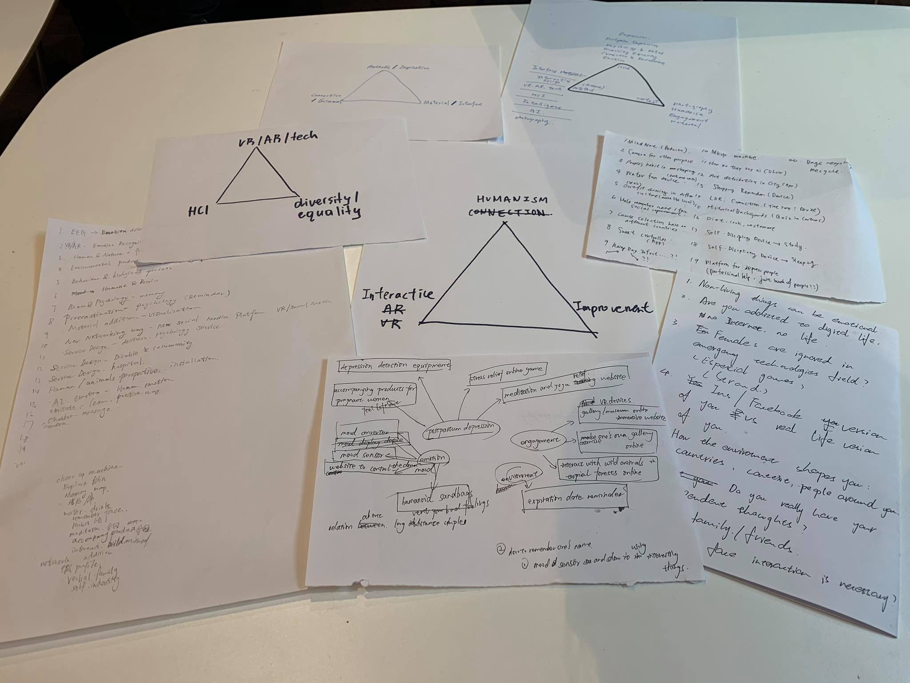

### Meeting Notes

* Each group members came up with at least 30 ideas and shared with each other 
* Everyone picked other's ideas that interest them
* List the most mentioned ideas as common interests
* Divergently think and discussed common interest topics 
* Draw the initial triangle

#### The Most Mentioned Ideas

1. Memory path
2. Female issues 
3. How the environment shapes people 
4. VR/AR experience 
5. Musical fountain 
6. VR social media
7. Long-distance relationship 
8. Social improvement 
9. Interactive design

#### The Triangulation

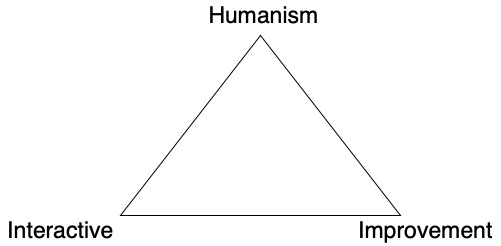
